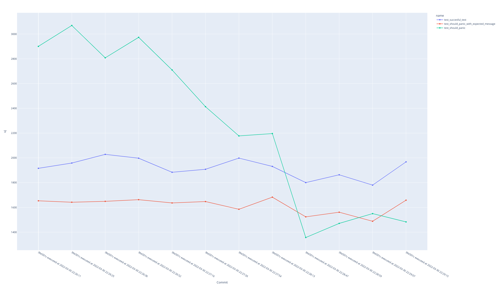

<p align="center">

</p>

<h1 align="center">Coppers</h1>

Coppers is a test harness for Rust that can measure the evolution of power consumptions of a Rust program between different versions with the help of [Intel RAPL](https://lwn.net/Articles/545745/).

## Requirements
* Rust nightly
* Linux
* A fairly recent Intel cpu, 2013 or later ([why?](#intel-rapl))

This test harness targets the Rust nightly toolchain because it relies on [unstable features of the Rust compiler](#stability-guarantees).
* First, make sure that you have installed the nightly toolchain with `rustup install nightly`
* Then, enable the nightly toolchain on this repository with `rustup override set nightly`

## Installation
To enable the custom test runner in your project, add this to your `Cargo.toml` file.
```toml
[dev-dependencies]
coppers = "0.1"
```
Add the following two lines to your crate root (most likely `lib.rs` or `main.rs`)
```rust
#![feature(custom_test_frameworks)]
#![test_runner(coppers::runner)]
```
## Usage
Using Coppers on your project can be done with `cargo test`. This will run your unit tests and report on the energy usage of each test. A report in JSON format will be generated in `target/coppers_results-[seconds since epoch].json`. This file contains machine-readable output of the tests.

Before you interpret the results, please consider the accuracy of the results and how you can improve it. See our [section about accuracy for more information](#accuracy).

## Visualization
Coppers optionally supports visual output of the results.
The visualizations can help with determining the change of energy consumption of your tests over time. To enable visualizations, enable the future flag in your `Cargo.toml` file.

```toml
[dev-dependencies]
coppers = { version = "0.1", features = ["visualization"]}
```

This feature is disabled by default, because it relies on certain Python packages. You can install the packages defined in this repository's `requirements.txt` file with
```
pip install -r requirements.txt
```

### Example plot

This example graph is generated by enabling the [`visualization` feature](#visualization). In this line plot, the test represented by the green line becomes more energy efficient over time. 


## Stability guarantees
We have developed this project with `rust version 1.61.0-nightly (ee915c34e 2022-03-28)`. A newer nightly version might change some of the compiler features we rely on, such as:
* [`#![feature(custom_test_frameworks)]`](https://doc.rust-lang.org/unstable-book/language-features/custom-test-frameworks.html)
* [`#![feature(test)]`](https://doc.rust-lang.org/unstable-book/library-features/test.html)
* [`#![feature(internal_output_capture)]`](https://doc.rust-lang.org/unstable-book/library-features/internal-output-capture.html)

We cannot guarantee that this project works with more recent nightly versions.

## Limitations
Our implementation comes with some limitations.

### Intel RAPL
Right now, this only works on Intel-based Linux machines with Intel RAPL via the [Power Capping Framework](https://www.kernel.org/doc/html/latest/power/powercap/powercap.html).
It could be extended for support on non-Intel and non-Linux machines, but this was outside the scope of our project.

### Accuracy
Measuring the energy consumption on the level of a single test might be very precise, but not very accurate.
Our current method measures the energy consumption of the entire system, which includes and/or is influenced by things like
* The operating system
* Your hardware configuration
* Other programs that are running at the same time
* Power management settings
* External devices such as USB drives, external disks, displays etc.
* Energy consumption of your internet adapter
* Brightness of your screen
* Temperature of your hardware
* Temperature of your real world environment
* Data in your cache (higher cache hit rate means that less energy is spend on retrieving data from memory)

For the most accurate, reliable and reproducible results, you could take certain precautions when running the tests. The goal of the precautions is to limit the influence of other factors. Precautions can include:
* Use the exact same hardware when you want to compare results with each other
* Close all applications that are not strictly necessary
* Turn of all notifications
* Only the minimum amount of hardware necessary should be connected, so avoid USB devices, external displays etc. if possible.
* Kill unnecessary services running in the background
* Switch off your network if it is not needed
    * If you do need internet, prefer a cable connection over wireless
* Disable auto brightness and set your brightness level as low as possible
* Repeating the tests multiple times

### Completeness
This project is far from complete, but it is what we could achieve within the short timespan of [the course we are following](#about). It could be extended and improved with things like
- [ ] Reporting the correct error code when a test fails
- [ ] Run on more platforms beside Intel based Linux machines
- [ ] Shuffle the tests around during execution, to avoid that tests are more energy efficient because of a high cache hit rate
- [ ] Make certain things more customizable, like the amount of times a test should be repeated or whether to ignore certain tests from the reporting

## Troubleshooting

### Intel RAPL sensors are not enabled
You might get an error like `The location `/sys/devices/virtual/powercap/intel-rapl/intel-rapl:0` is unreachable`. If you have an Intel based machine, then you can enable on the Intel RAPL sensors with modprobe in the following way `modprobe intel_rapl_common` for Linux kernels of >= 5. Do you have a kernel version of < 5, then use `modprobe intel_rapl`. Unfortunatly, Coppers does not support non-Intel based machines at this time.

### Running the tests causes `Insufficient permissions`
If you run `cargo test`, you might get an
```
thread 'main' panicked at 'called `Result::unwrap()` on an `Err` value: "Insufficient permissions to read from /sys/devices/virtual/powercap/intel-rapl/intel-rapl:0/energy_uj. You might want to retry as root."' 
```
error. This can be solved in one of two ways:
1. Either run the tests again with root permissions, with `sudo -E cargo test`.
2. Or temporarily add read permissions to `/sys/devices/virtual/powercap/intel-rapl/intel-rapl:0/energy_uj` by running
    1. `sudo chmod o+r /sys/devices/virtual/powercap/intel-rapl/intel-rapl:0/energy_uj`
    2. `cargo test`
    3. `sudo chmod o-r /sys/devices/virtual/powercap/intel-rapl/intel-rapl:0/energy_uj`

### ModuleNotFoundError
If you run with the [`visualization` feature](#visualization) enabled, then you also need to install the required Python packages. This can be done by installing the packages defined in this
repositories [`requirements.txt`](/requirements.txt) with `pip install -r requirements.txt`.

## About
This project was done in the context of the [2022 edition of Sustainable Software Engineering course at Delft University of Technology](https://luiscruz.github.io/course_sustainableSE/2022/). We chose the name "Coppers" because our project relates to both green software and Rust, and oxidized copper has a green-ish color.

## License
Licensed under the Apache License, Version 2.0 (the "License");
you may not use this file except in compliance with the License.
You may obtain a copy of the License at http://www.apache.org/licenses/LICENSE-2.0

Unless required by applicable law or agreed to in writing, software
distributed under the License is distributed on an "AS IS" BASIS,
WITHOUT WARRANTIES OR CONDITIONS OF ANY KIND, either express or implied.
See the License for the specific language governing permissions and
limitations under the License.
